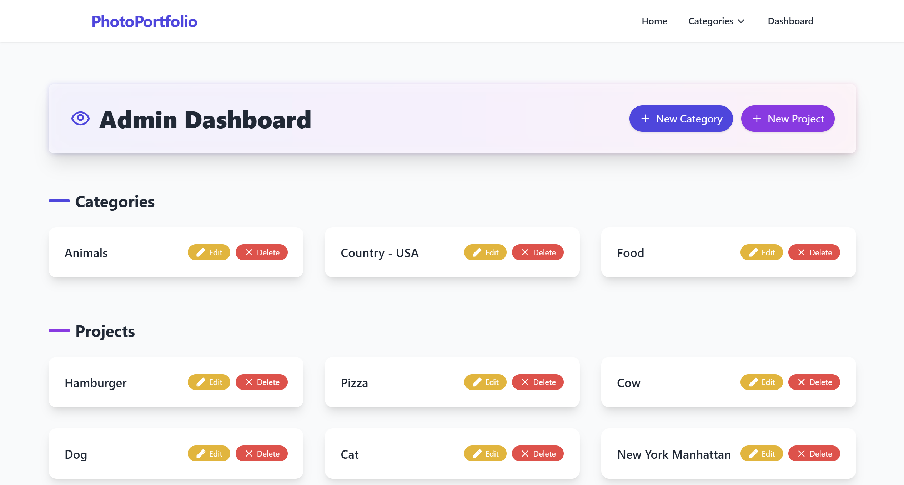

# 📸 PhotoPortfolio

A dynamic **Node.js + Express + SQLite** web application for cataloguing and showcasing your projects or photos by category. Designed with a clean Tailwind-powered interface, the app features an admin dashboard for CRUD operations, smooth animations, and responsive layouts throughout.

---

## ✨ Features

| Area | Highlights |
|------|------------|
| **Frontend** | Tailwind CSS, Hero & card animations, mobile-first navigation, glass-morphism panels |
| **Backend**  | Express router structure, SQLite (via `sqlite3`), Handlebars templating |
| **Admin**    | Dashboard with fade-in sections, create/edit/delete for categories & projects |
| **Public**   | Home page with latest additions, category pages (single-column lists), responsive image cards |

---

## 📂 Project Structure

```
├── db/                 # SQLite DB & init script
│   ├── database.js     # Table creation / connection
│   └── portfolio.db    # Actual database file
├── models/             # Data-access helpers
│   ├── category.js
│   └── project.js
├── routes/             # Express routers
│   ├── index.js        # Home page
│   ├── category.js     # Public category pages
│   └── admin.js        # Dashboard & CRUD
├── views/              # Handlebars templates
│   ├── layouts/main.handlebars
│   ├── home.handlebars
│   ├── category.handlebars
│   └── admin/          # dashboard & forms
│       ├── dashboard.handlebars
│       ├── category-form.handlebars
│       └── project-form.handlebars
├── public/css/style.css (optional extra styles)
└── app.js              # App entry-point
```

---

## 🚀 Quick Start

```bash
# 1. Install dependencies
npm install

# 2. Start the dev server (with nodemon if available)
npm run dev

# 3. Visit
#    • http://localhost:3000          → Public site
#    • http://localhost:3000/admin    → Admin dashboard
```

> **Tip:** The first run auto-creates *`db/portfolio.db`* with two tables: `categories` & `projects`.

---

## 🔧 Configuration

| File | Purpose |
|------|---------|
| **`db/database.js`** | Opens / seeds the SQLite database (`AUTOINCREMENT` primary keys). |
| **`app.js`** | Configures Handlebars, Tailwind CDN, body-parser, method-override, and a middleware that injects `navCats` + `year` into every view. |
| **`routes/admin.js`** | All admin CRUD routes. Uses `?_method=PUT|DELETE` for HTML-only forms. |

---

## 📸 Screenshots

| Home                       | Dashboard                   |
|----------------------------|-----------------------------|
|  |  |

---


